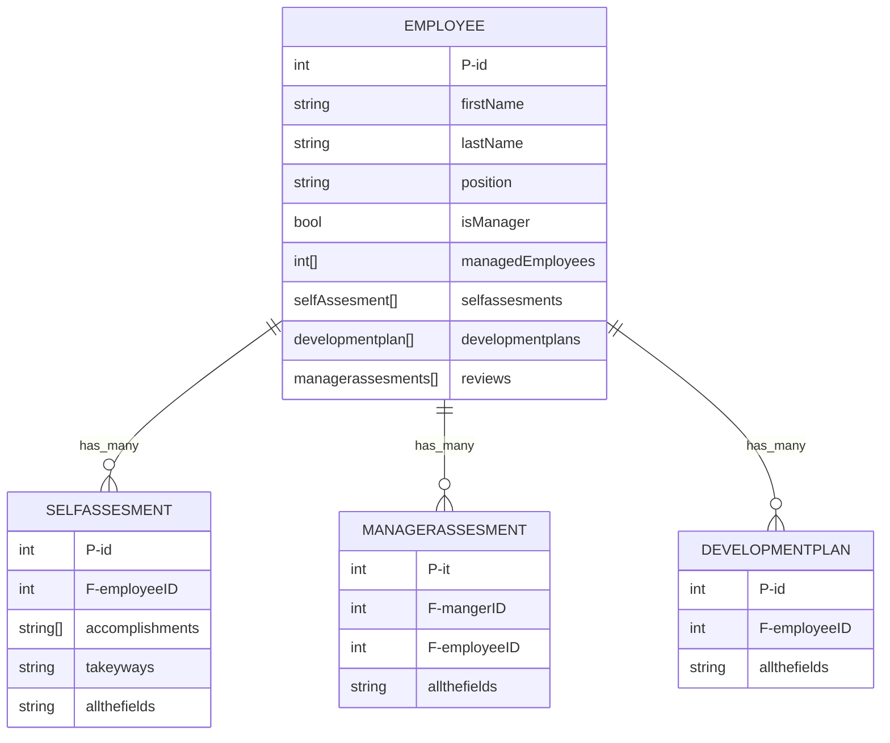
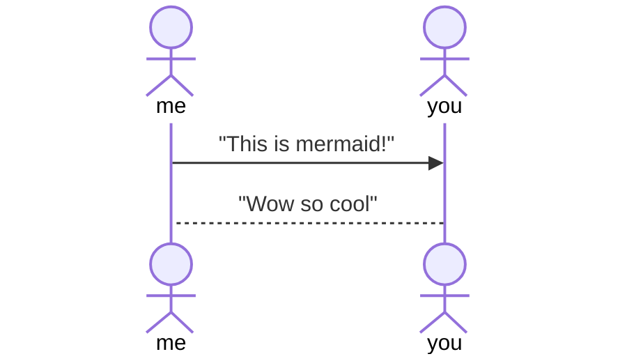

# Dreamcast Senior Project

## Local Dev Set Up

## Documentation

```mermaid
erDiagram
    EMPLOYEE ||--o{ SELFASSESMENT : has_many
    EMPLOYEE ||--o{ MANAGERASSESMENT : has_many
    EMPLOYEE ||--o{ DEVELOPMENTPLAN : has_many
    EMPLOYEE {
        int P-id
        string firstName
        string lastName
        string position
        bool isManager
        int[] managedEmployees
        selfAssesment[] selfassesments
        developmentplan[] developmentplans
        managerassesments[] reviews
    }

    SELFASSESMENT {
        int P-id
        int F-employeeID
        string[] accomplishments
        string takeyways
        string allthefields
    }

    DEVELOPMENTPLAN {
        int P-id
        int F-employeeID
        string allthefields
    }

    MANAGERASSESMENT {
        int P-it
        int F-mangerID
        int F-employeeID
        string allthefields
    }
```

### Sequence

```mermaid
    sequenceDiagram
        actor me
        actor you
        me->>you: "This is mermaid!"
        you-->me: "Wow so cool"
```