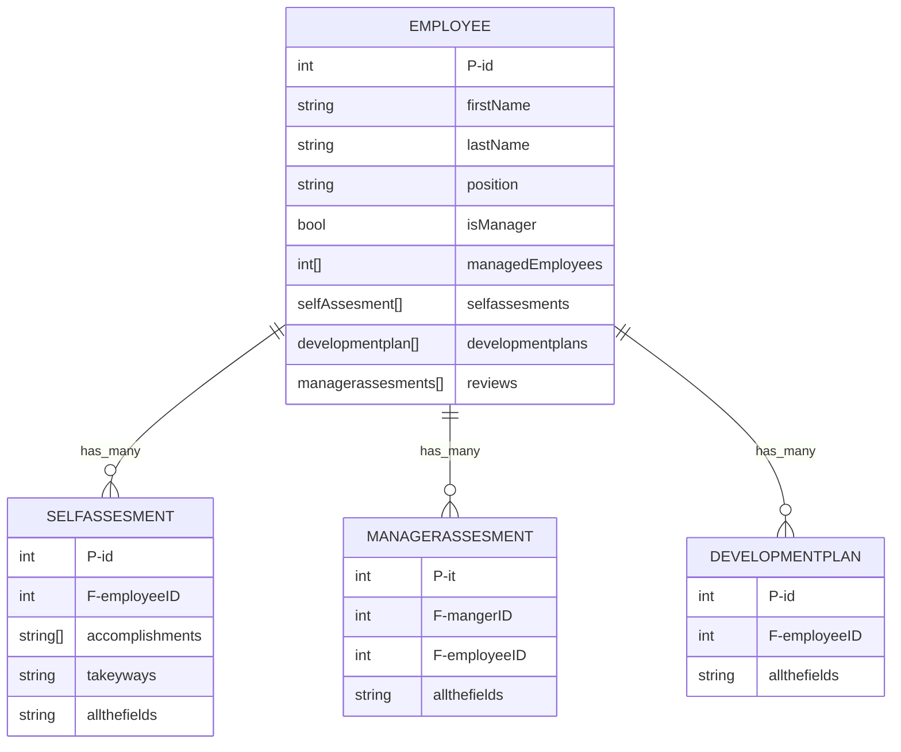
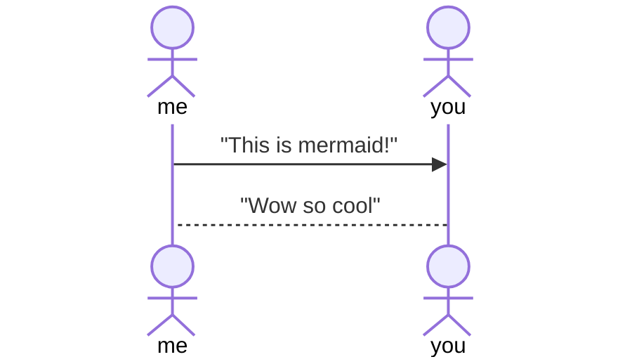

# Dreamcast Senior Project
## 1. Introduction 
#### 1.1 Purpose
- Risen One Consulting - Employee Development Portal 
#### 1.2 Scope 
- This solution will allow employees and management to set goals, go over performance evaluations, and set development plans that will assist in employee-to-supervisor management as well as motivate and encourage employees. This is being developed as a portion of the already existing Risen One employee portal and should make the review process much easier.

#### 1.3 Definitions, acronyms, and abbreviations 
- `Development Plan` - a document filled out by an employee that outlines their specific short and long-term goals. Allows employees to outline any development needs they have or raise concerns.
- `Self Assessments` - a document filled out by an employee that they can outline their successful moments, strengths, and weaknesses throughout a given review cycle.
- `Manager Assessments` - a document filled out by a manager that can outline an employee's successful moments, strengths, and weaknesses throughout a given review cycle. Managers can use this form to submit to also give feedback to their employees.
### 2. Specific requirements
- The system will be developed with the implementation of NodeJS, serverless framework including AWS Lambda and DynamoDB for the backend API, and use the Angular and JavaScript programming languages to implement the employee-facing GUI. 
#### 2.1 External Interface Requirement
- The application should communicate between the front end and back end by sending JSON objects outlining the properties to be stored/manipulated in the backend or displayed on the front end. When a request is made to the backend for a specific employee or development plan, the system will request it from the corresponding table, return the findings and output them for the user.

#### 2.2 Functional Requirement
- The system shall...
    - Allow employees the opportunity to create, update, delete, and view `development plans` outlining their goals and aspirations.
    - Allow employees the opportunity to create, update, delete, and view `self-assessments` that allow them to log thoughts about their current work.
    - Allow employees the opportunity to view `performance evaluations` submitted by managers regarding work done throughout a review cycle.
    - Allow managers to submit `performance evaluations` outlining improvement points and praise for employee work.
    - Allow employees to move freely between three tabs displaying the above plans/evaluations.
    - Allow managers and employees to request previous iterations of the outlined plans/evaluations.
    - Only allow managers to create and edit `performance evaluations` and only allow them to create evaluations for employees under them.

## Local Dev Set Up

## Documentation

### Sequence
