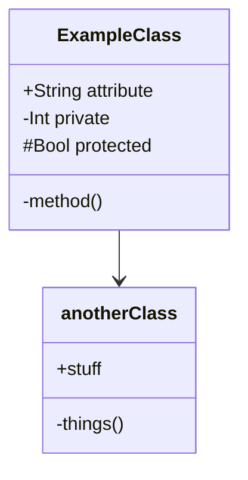
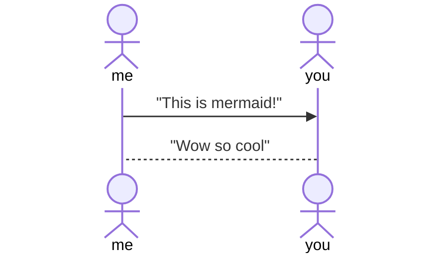

# Dreamcast Senior Project

## Example Mermaid Diagrams

### Class

```mermaid
    classDiagram

        ExampleClass-->anotherClass

        class ExampleClass{
            +String attribute
            -Int private
            #Bool protected
            -method()
        }

        class anotherClass{
            +stuff
            -things()
        }
```

### Sequence

```mermaid
    sequenceDiagram
        actor me
        actor you
        me->>you: "This is mermaid!"
        you-->me: "Wow so cool"
```